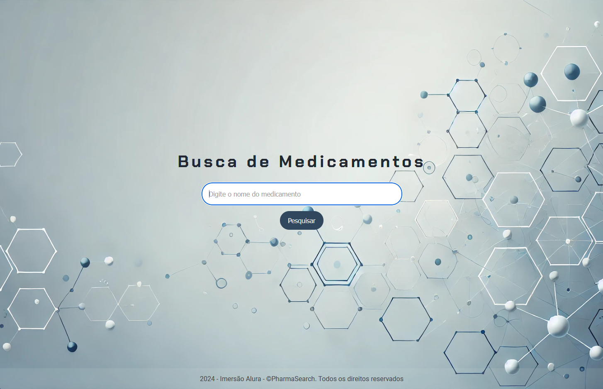
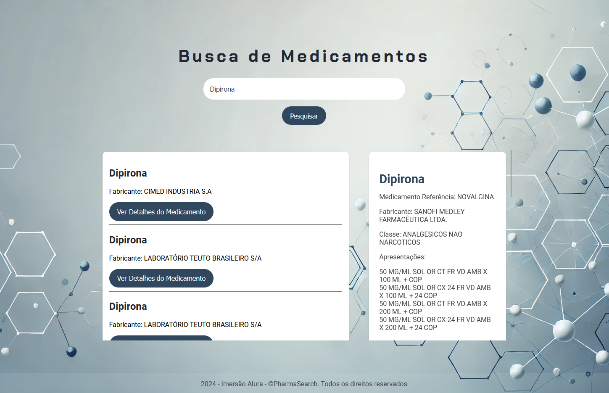

# PharmaSearch

**PharmaSearch** é uma aplicação web simples que permite aos usuários buscar por informações de medicamentos de forma rápida e eficiente. A aplicação utiliza HTML, CSS e JavaScript para a interface e se conecta à **Bulario API** para obter dados sobre medicamentos.

## Funcionalidades

- Busca de medicamentos pelo nome usando a API do Bulario.
- Exibição de resultados relevantes com detalhes sobre o medicamento.
- Interface responsiva e amigável para dispositivos móveis e desktops.

## Tecnologias Utilizadas

- **HTML**: Estruturação da página.
- **CSS**: Estilização da interface.
- **JavaScript**: Manipulação da lógica de busca e exibição dos dados.
- **Bulario API**: Fonte de dados para informações sobre medicamentos.
